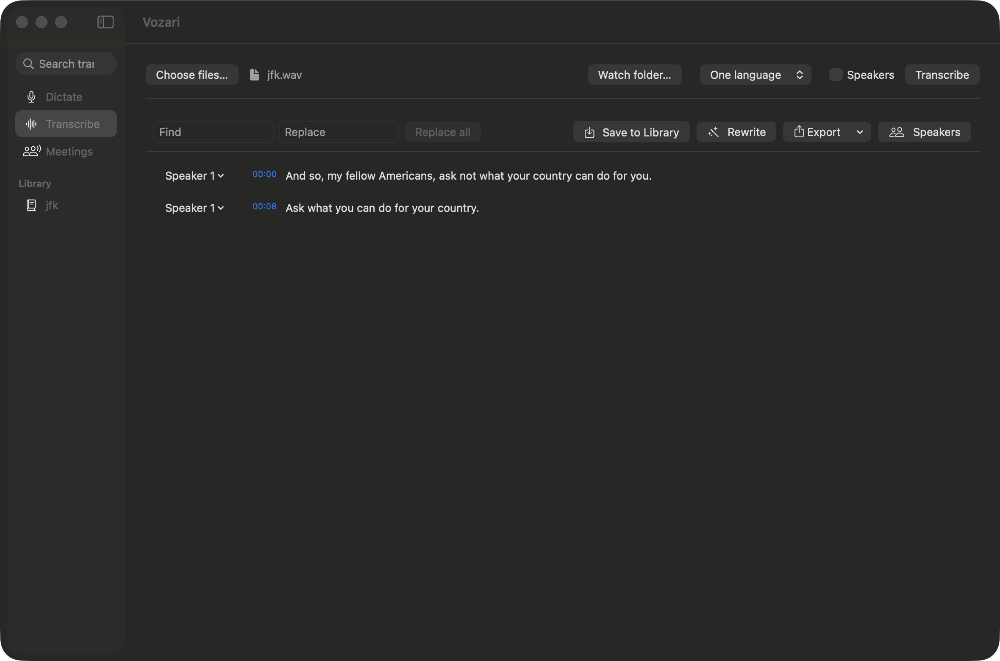
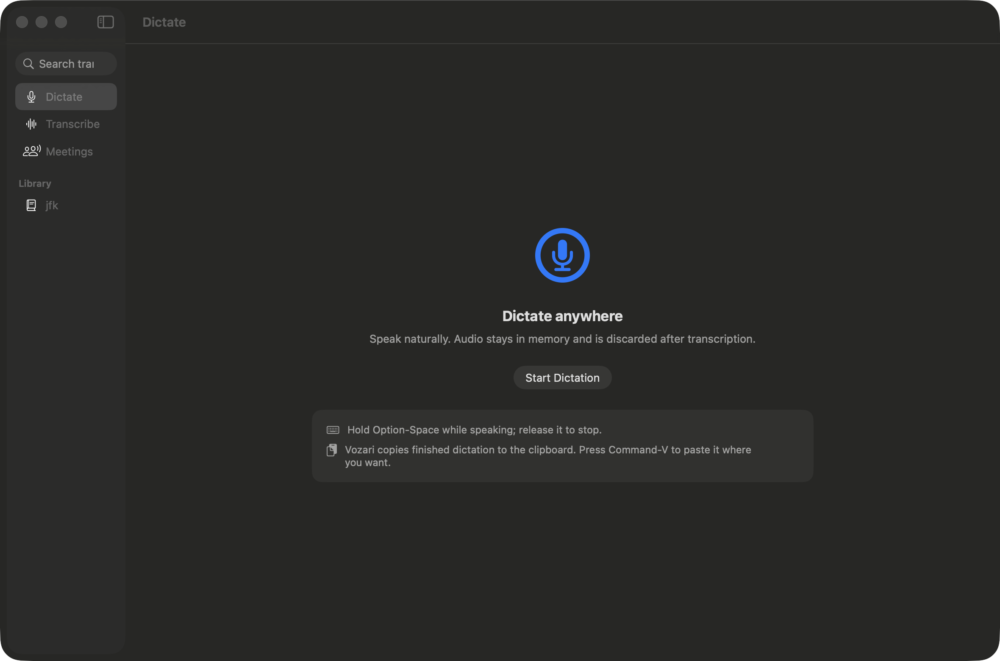
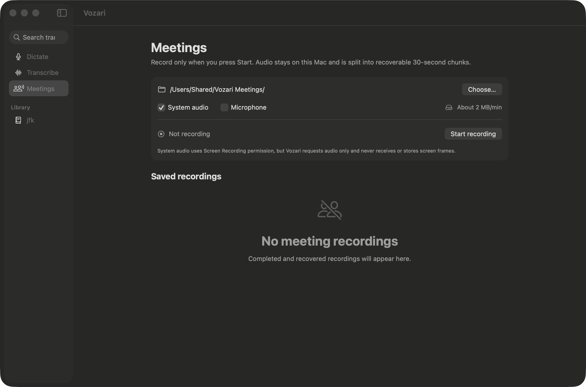
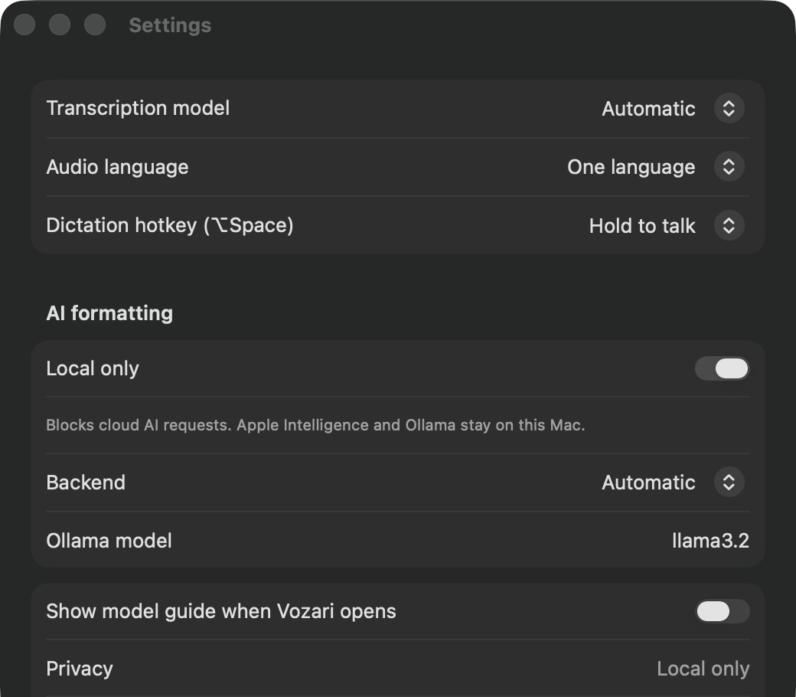
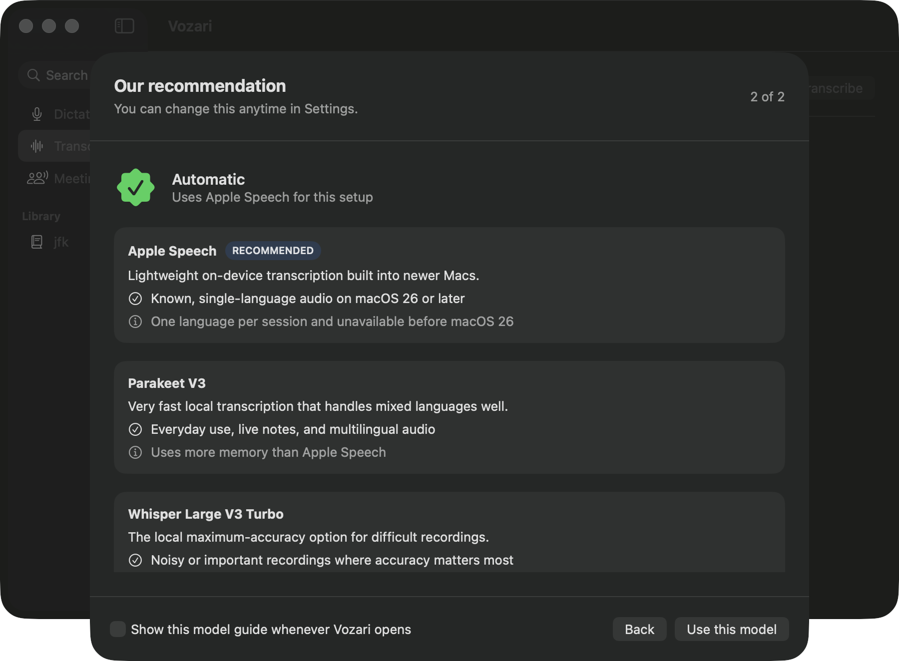

# Vozari

**Private voice to text for Mac.**
System-wide dictation and file/meeting transcription — fully on-device, no subscription.

---

> **Portfolio repository.** This repo showcases the product and the engineering behind it.
> It contains no source code, no build artifacts, and nothing downloadable — screenshots and write-up only.
>
> Live pages: [Product overview](https://kadin-hunter.github.io/Vozari-Portfolio/) · [Privacy policy](https://kadin-hunter.github.io/Vozari-Portfolio/privacy/) · [Support](https://kadin-hunter.github.io/Vozari-Portfolio/support/)

---

## What it is

Vozari is a native macOS app (Swift + SwiftUI, menu-bar-first, no Electron) that does two jobs in one product:

1. **System-wide dictation** — hold `⌥Space`, speak, and the text lands at your cursor in whatever app you're in. Sub-200 ms from speech end to inserted text, measured on real weights.
2. **File & meeting transcription** — drop in audio or video, or record a meeting from system audio and/or mic, and get an editable, speaker-labelled, exportable transcript.

Everything runs locally. No account, no telemetry, no transcription service in the middle.

---

## Screenshots

**Transcribe** — drop in audio or video, get an editable transcript with timestamps, speaker labels, find/replace, AI rewrite, and a seven-format export menu.

**Dictate** — hold ⌥Space anywhere in macOS and speak. Audio stays in memory and is discarded after transcription; it is never written to disk.

**Meetings** — record system audio, the microphone, or both, only after you press Start. Audio is split into 30-second chunks so an interrupted session is still recoverable.

**Settings** — intent-framed model choice, hold-to-talk or toggle dictation, and a single **Local only** switch that blocks every cloud AI request at one gate.

**Model guide** — a two-question first run picks the engine for you and explains the trade-off in plain language, instead of asking which speech model you'd like.

---

## Why it's different

| | |
|---|---|
| **Local-first, by construction** | Dictation audio never touches disk — it lives in memory as float samples and is discarded after transcription. Source files stay where you put them. Meeting audio is written only after you press Start. |
| **Three transcription engines, one honest default** | Apple SpeechAnalyzer, NVIDIA Parakeet v3, and Whisper large-v3-turbo behind one protocol. The app picks for you; you can override with intent ("fastest" / "most accurate" / "multilingual") rather than model names. |
| **Real bilingual handling** | Benchmarked on EN/ES code-switching audio, not just clean English. The engine ordering was chosen *because* of what the numbers showed on mixed-language speech. |
| **One-time price** | Target $79–99, lifetime. The free tier is capped by usage, never by model quality — you never get a worse model for being on free. |
| **Two builds, one codebase** | A direct build with full Accessibility-API insertion, and a sandboxed Mac App Store build that degrades cleanly to clipboard paste. A CI gate greps the MAS binary to prove it links no Accessibility insertion symbol. |
| **Editable output that survives the last mile** | Inline editing, click-to-play with active-turn highlight, find/replace, speaker rename/merge/reassign, a personal dictionary that fixes proper nouns permanently, and export to TXT, Markdown, CSV, SRT, VTT, DOCX, and PDF. |

---

## Benefits, plainly

- **Type less.** Dictation is faster than typing and works in every app, not just the ones with a text field the app knows about.
- **Your audio stays yours.** Interviews, therapy notes, legal calls, client meetings — none of it leaves the Mac. This is a design constraint in the codebase, not a settings toggle.
- **No monthly bill.** Buy once. The competitors in this category charge $10–20/month for the same job.
- **Correct names, every time.** Teach it a proper noun once and every future transcript spells it right.
- **Works on older Macs.** macOS 14 (Sonoma) floor. Newer OSes get the faster Apple engine automatically; older ones get Parakeet, which is a fast, accurate engine in its own right — not a degraded fallback.
- **Fixes what diarization gets wrong.** Speaker splitting is never perfect, so merge and reassign are first-class controls, not a v2 promise.

---

## The engine benchmark

The three-engine layer wasn't a guess. All three were benchmarked on the same real Mac-recorded audio (M1 Max), with word error rate measured against a typed reference.

**Monolingual English — 4.3 min single-speaker read-aloud**

| Engine | Speed (× realtime) | Peak RAM | WER |
|---|---|---|---|
| Apple SpeechAnalyzer | 45× | **22 MB** | 0.04 |
| Whisper large-v3-turbo | 29× | 1933 MB | **0.02** |
| Parakeet v3 | **128×** | 176 MB | 0.09 |

**Bilingual EN/ES — 7.2 min two-speaker code-switching dialog**

| Engine | Speed (× realtime) | Peak RAM | WER |
|---|---|---|---|
| Apple SpeechAnalyzer (en-US) | 41× | **22 MB** | **0.30** |
| Whisper large-v3-turbo | 26× | 1963 MB | **0.09** |
| Parakeet v3 | **70×** | 212 MB | 0.11 |

**What the numbers decided:** a SpeechAnalyzer session is single-locale, so on mixed-language speech it phonetically mangles the other language — WER jumps from 0.04 to 0.30. That's structural, not tunable. Whisper handles it best (0.09), but Parakeet is within 2 points of it at **2.6× the speed and ~1/9th the memory**.

So: Apple for known-monolingual on macOS 26+, Parakeet as the multilingual default and the macOS 14–15 floor engine, Whisper as the max-accuracy reserve that `auto` never picks on its own.

---

## Dictation latency

The shipping gate was **first inserted text ≤ 400 ms after speech end**. A measurement harness was built before the feature, not after.

Measured on a real 3-second utterance with real Parakeet weights, **debug** build:

| | Latency | vs 400 ms budget |
|---|---|---|
| Cold (first utterance, incl. CoreML kernel compile) | **0.215 s** | ✅ |
| Warm (steady state) | **0.180 s** | ✅ |

Release builds are faster still.

---

## How it's built

- **Swift 6, strict concurrency**, SwiftUI + AppKit where AppKit is genuinely required (borderless non-activating dictation pill, global hotkey monitors, Accessibility insertion).
- **Two-module split:** a headless `VozariCore` library holding every piece of pure logic — transcript model, engine protocol and adapters, engine resolver, exports, hallucination guard, personal dictionary, library store, batch queue, network policy, diarization, formatting backends — and a thin SwiftUI app layer on top. The core is unit-testable with no hardware, no model downloads, and no UI.
- **~90 tests green**, plus opt-in integration tests that download real model weights and run them against real recorded audio.
- **A single network egress gate.** The "local only" promise is one `NetworkPolicy` check point, not a scattering of per-feature conditionals. API keys, when a user opts into a cloud backend, live in the Keychain only.
- **A compile-flag distribution boundary** (`DIRECT_DISTRIBUTION` / `MAS_DISTRIBUTION`) verified by a script that builds both configurations and greps the resulting MAS binary for forbidden symbols.
- **AI formatting behind a swappable seam** — Apple Foundation Models on-device by default (zero setup, no bundled weights, no network call), with Ollama and bring-your-own-key as opt-in power-user backends.
- **A written decision log.** Every architectural call (D001–D008) records what was decided, the evidence behind it, and what would reverse it.

---

## Engineering decisions worth noting

- **Dual distribution from one codebase.** Apple rejects Accessibility-API text insertion under Guideline 2.4.5, so the App Store build can't have system-wide dictation. Rather than fork or ship a lesser product, the insertion path is compiled out entirely for MAS and replaced with clipboard paste — and the boundary is machine-verified rather than trusted.
- **Codable file store over SwiftData.** Under Swift 6 strict concurrency, SwiftData's model types are non-Sendable and main-actor-bound, which adds real ceremony for what v1 needs. A directory of JSON records is trivially testable headless and has no migration surface. The upgrade path to SQLite FTS is written down, with the threshold that would trigger it.
- **Engine choice framed as intent, not model names.** Users don't know what Parakeet is, and the intent-to-engine mapping is OS-dependent and non-orthogonal. Smart default first, override behind an Advanced surface — never a required up-front choice.
- **Diarization ships label-after first.** Detect speakers, let the user name them once to relabel every turn in that cluster, carry names into every export. Voice enrollment is biometric data and belongs on top of a working pipeline, not underneath it.
- **Hallucination guard.** Whisper-family models repeat themselves on silence. Repetition is detected, the offending span is re-run once, and it's flagged for the user if it persists.

---

## Status

Core product complete: dictation, file transcription, meeting capture, library, batch processing, watch folders, exports, diarization, AI formatting. Remaining work is release engineering — signing, notarization, StoreKit, and App Store submission.

---

Designed and built by **Kadin Hunter** · [Hunter Ops Digital & IT Solutions](https://github.com/Kadin-Hunter)

